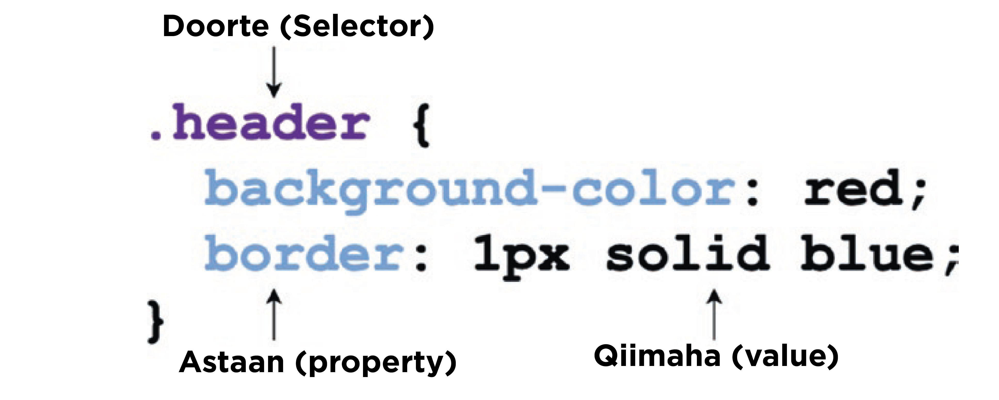

# Waaa maxay CSS ?

Inta aan ka hadal waa maxay CSS, waxan halkaan ku cadeynaya in xogta ku jirta Repository gan badankiisa aan ka kala keenay marjicyada (refrence) [Halkaan](/Resources.md) ku xusa, oo u turjumay ama u badelay Af-Somali, iyo qaar kaloo oo aan aniga kudray anigo kaa shanaya aqoonta yar ee aan u leeyhay CSS, si qof walba oo afsomali ku hadla daneynaayana barashada CSS uu wax badan ka ga faa'ido.

CSS waxa laga soo gaabiyay **Cascading Style Sheet** waa luqad tilmaanta hanaanka HTML loogu so bandhigaayo Browser, CSS hadaysan Jiri lahayn, HTML keenu waxa u ukeen lahaa qoraal word document lagu qoray, oo aan wax midab ah lahyn `Madow Iyo Cadaan` kaliya (Black & White).

Css waxa ay uwood ledahy in ay gabi ahaanba badasho qaabka uu HTML keena uu u'egyahay, waxay a awood uledahy in ay siiso (HTML Elemets) Midabo kala ceyn ah Kal jaad ah, in ay weyneyn karto, yareyn karto cabirka (Element-ga) badasho booska (position) uu yaalo (Element-ga) iyo kuwa kale o badan.

Tusaale hadaan so qaado CSS waxay u taganthay Booska Dharka qofka uu xirnayhy o kale, sida uu uqorxoonyahy qofka marka uu labis fcn xirto, sidaaso kle ayay u dahaartaa (HTML Elements-ka) si ay u noqdaan wax ay ishu aad ugu riyaaqo marka ay milicsaneyso.

### Taarikhda CSS

Inta aysan soo Bixin CSS-ka awooda HTML-ka dhanka qruxda (Style) aad bay u yareyd, o wax badan oo maanta (HTML ELemnts) aan ku qurxn karno mysan jirin.

Tusaale haan hoose waxa u kutusinya sida ay ukobned awooda HTML ka int aysan CSS ka so bixin

```html
<font face="Arial, sans-serif" color="blue" size="12"> Hello world! </font>
```

Tusaalaha kore waxa uu na tusaya sida loo badli jiray farta (Font) website ka inta aynan so bixin CSS.

Hadaba CSS ka waxa laso jeediyay (porposal) Shir (conference) ka dhacay **Chicago** Sanadii **1994** kii, sandkaas sanadki ku xigayna waxaa Soo baxay hay'ad (organization) lagu magacaabo **World Wide Web Consortium (W3C)**, kadbna CSS waxay si rasmi ah usoo baxday sanaddi 1996 kii.

### Qolfoof Dhismeedka CSS (Anatomy)

CSS waxa ay ka koobantahay Sharciyo (Rules), Sharciyada CSS waxay beegsadaan (Target) (HTML Element) ga ayaga oo isticmaalaya waxa loo yaqaano Doorte (Selector) kaaso tilmaamaya ama shegaya (Element) ga larabo in Qurxudan (Style) lagu Dabaqo (Apply), Sidaan gadaal ka arki doonto waxaa jira dhowr nuu oo aan (Element) u dooran karno.

### Sharciga Qoran (Rule Syntax)

Sharciga waxa uu ka koobanyahay doorte (Selector) lagu daray xeyn (block) astaamo (properties) ah taaso ku dhax jirta labo Qoys weyn (curly braces) dhaxdooda.
Astaamaha (properties) ka waxa ay ka koobanyhin astaan iyo qimaheed oo loo dhaxeysiyay colon ( : ), Qimaha waxa uu noqon karaa hal qimo kali ah, ama qimo yaal kala dugan oo ay kala hakiso meel faaruq ah (space), ama qimo yaal kala dugan oo ay kala hakiso hakad ( , ) laguna soo afmeeray semi-colon ( ; ).



sharcigan kor ku xusan waxa uu beegsanayaa (Target) (Element) leh (class) lagu magacaabo `header` (Class) waxa u yahay Gadaal baan ka baran doona, (Element) walba oo leh (Class) kaas magacisa kor ku xusanyhy waxa uu yelan daah (background) midbkisu cas yahay, waxa kale uu yelan doona xeyndaab (border) xariiq ah (Solid) cabirkeedu dhanyhay `1px`,lehna midbaka bluuga ah (blue).

**NB:** Haka walwalin `Class` iyo `Cabiradaba` waxa so dhan gadaal baan kabaran doona, hadu eebe weyne idmo.

### Isku dhaca Astaamaha (Property conflicts)

Isku dhaxa ama khilaafka astaatmaha waxa u yimaada marki hal (Element) aan siino Astaamo isku mid balse aha kala qiimo gadisan.
Tusaale hadaan rabno (Element-ga) leh (Class) ka `Header` hada siino labo astaan isku mid ah sida midbka daaha gadaale (Background-color) blue ah iyo gaduud ah, halkaas waxa ka dhalanya khilaaf ama isku dhac ku yimaada astaamaha aan siinay isku halka (Element).

```css
.header {
  background-color: red;
  background-color: blue;
}
```

kor waxan ka argaan in labo maarn aan so cel celinay inaa waxa ka badalno qimaha midbada daaha gadaale marna aan ka dhgnay casaan marna aan ka dhignay blue, waxa yimid wareer ah labada qiimo kee la qadnaya ?

### Comentes

Comment waa qoraal lagu dhax qoro code walba oo aad qoryso si aad uso xasuusto, code kan waxa u qabnyo ama dadka kale ula wadagtid.
Commentga waxa loogu talo galay dadka (Compiler) ku waa uu iska indha tirayaa ama ilaabaya in qoraalkaas uu (Run) greyo.

```css
/* Kani waa comment */
```

CSS marki lajoogo si aad comment uqrto waxa ka bilaabysa /\* si aad ugu shegto (Compiler) ka in meshan wixi kadanbeeya u kaboodo ilaa inta commentig laga so xirayo waana inaad so xirtaa

```css
.header {
  /* waxaan ka dhigayna midabka farta casaan ama gaduud */
  color: red;
}
```

### Sharciyada @ (@ Rules)

Sharciyada @ waa kuwa gaar ah kuwaas oo u dhaqam sida inay xukumaan gooyan go aan ka qataan Sharci gooni ah goorta uu dhaqan galayo.
waa kuwaan qaar kamid ah Sharciga @

- @charset: waxa uu qeexaa waxa lagu (encode) greyay xaruufta (Charracter)
- @import: wuxuu so rogaa, galiyaa, xogaha kujirya (style) kale
- @media: waxa u qexa waxa loyaqno `media query`
- @keyframes: waxa u qexa `key frame` marka lajoogo (animation) ka CSS.

### Sidee CSS Lo isticmaalaa

waxa jira dhowr hanaan oo kala dugan kuwaso sahalya in CSS lagu isticmalao (HTML) ka.
waxayna kala yihiin

- inline style
- Style Block
- External Style sheet

seddexdaas hanaan oo ana kor kuso shegay waa seddexda qaab ee CSS logu isticmaali karo HTML.

### Inline Style

waa (style) lagu qoro si toos ah (Element) ga larabo in wax (style) kiisa, (Inline Style) ku malahn Doorte (Selector) ama Qoys ka weyn (Curly Praces).

```html
<div style="background-color: red;">Hello world!</div>
```

sida aad ka aragto halkan (style) toos ayaa loo siyay (Element) waxaana lo yaqana `Attribute`
Faa'idada u leyhy inline stylku waxa weye in aysan cid kale ka dulqaadin karin awooda sinte (Element) ga style laga badalo, hadii khilaaf u jirana mar walba asaga ayaa xoogga iska leh.

### Block Style

Sidoo kale sharciyada CSS ka si toos ah aya logu dhax qori karaa (File) ka (HTML) ka, waxan ugu qori karta qeybta (Head) ka ee (HTML) ka aya waxa ku darays (tag) lo yaqano (Style).

```html
<!DOCTYPE html>
<html>
  <head>
    <!-- Halkan Eeg -->
    <style>
      div {
        background-color: red;
      }
    </style>
    <!-- Dhamaadka Eeg -->
  </head>
  <body>
    <div>Hello world!</div>
  </body>
</html>
```

sida kor ka aragtaan (Style) taagasa ayan ku dhaxqornay qeybtsa sare ee (headka) file ka (HTML) ka.

### External style sheets

ugu danbeyn Sharciyada CSS waxa lagu qori karaa file ugooni ah oo magaciisa uu ku dhumanyo `.css` kadbna si marjac ah (refrence) ayaa loogu qoraa madax hore ee filke (HTML) ka anagoo isticmaalyna (tag) lo yaqano `link`

```html
<!DOCTYPE html>
<html>
  <head>
    <!-- sida tan loo go qoraa -->
    <link rel="stylesheet" href="halka uyalo filka css" />
  </head>
  <body>
    <div>Hello world!</div>
  </body>
</html>
```
